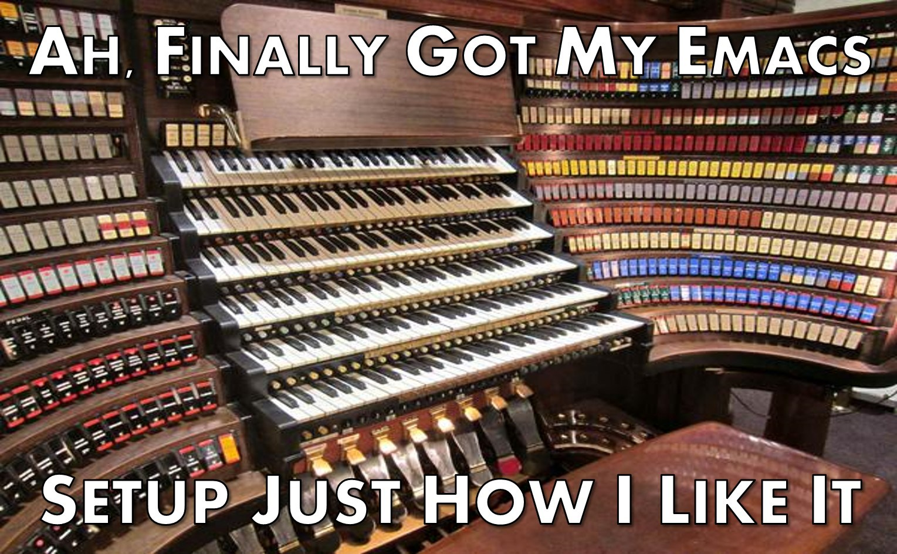
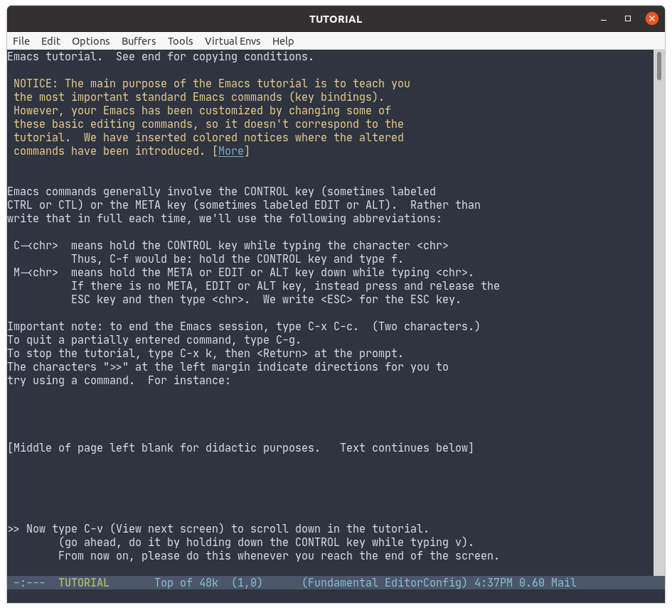

## Emacs: Getting Started

::::: {.columns}
::: {.column width="60%"}

\bigskip

### The Perception of Emacs

. . .

\bigskip

:::
::: {.column width="40%"}

\small

. . .

### Intimidated?

. . .

- Decades of history.

- Bazillion tutorials.

- _Opinionated_ views.

\smallskip 

. . .

### But fear not!

. . .

- _Incremental use_ works.

- Learn a few steps. Master them.

- Learn some more.

:::
::::::

## Emacs: Basics Movement

::::: {.columns}
::: {.column width="50%"}

:::
::: {.column width="50%"}

### A really good \alert{builtin} resource

\medskip

. . .

- The Emacs Tutorial
  - just hit `C-h t`
  - ie type `Ctrl` _and `h`_, then type `t`.
- Covers a lot of the basis
- Worth spending some time with
- And revisiting

\medskip

:::
::::::

## Emacs: Editing

### Key Advantages

. . .

- Particular uses _carry from one mode to another_ for (essentially)
  all forms of text

- There are too many to enumerate but ...

- ... (maybe my) favourite example

  - `C-space` to mark a starting
  - Navigate to end
  - `M-x comment-region` will uncomment the regions
  - In \alert{any programming language} or \alert{text format}

- Also cool:  Prefix the same with `C-u` ("undo") to uncomment

## Emacs: Editing

### More Key Advantages (via Somewhat Random Personal Selection)

. . .

- Indentation is always sensitive to the programming language

- `M-q` formats ("flows") indents a paragraph

- `C-M-\` indents a region in the current language

- Very powerful 'undo' feature

- Rectangular regions (could be a five-mi presentation in itself)

- 'Record' key sequence to 'replay' for ad-hoc automation (ditto)

- Named Register to hold paste-able content or positions (ditto)

## Resources

### This is a semi-random collection

\footnotesize 

- Awesome Emacs https://github.com/emacs-tw/awesome-emacs

- Collection of resources (2011) https://batsov.com/articles/2011/11/30/the-ultimate-collection-of-emacs-resources/

- Opinionated Emacs Guide https://m00natic.github.io/emacs/emacs-wiki.html

- Batteries Included https://karthinks.com/software/batteries-included-with-emacs/
  
- More Batteries Included   https://karthinks.com/software/more-batteries-included-with-emacs/
  
- EmacsLife Video List https://emacslife.com/videos.html  

## Credits

\footnotesize 

### Images and Logos

- ESS logo from the ESS Project site hosted by the R Project at https://ess.r-project.org

- Emacs Organ image from http://anagilemind.net/2015/07/31/a-few-more-agile-related-memes/ah-finally-got-my-emacs-setup-just-how-i-like-it-v2/
